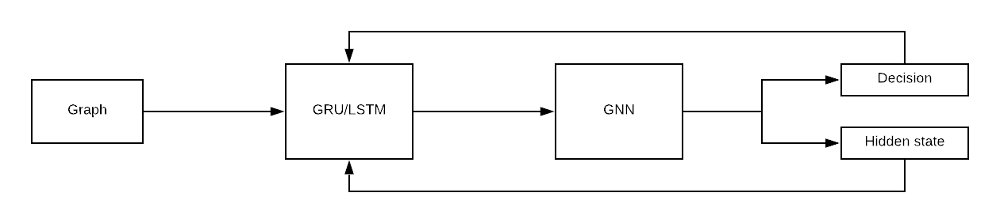
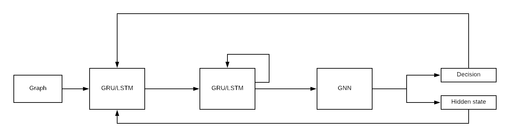

# Graph Pruning at the CMS HGCAL
This repository contains code to train and evaluate a graph pruning model on CMS HGCAL event data.
The data used here is preprocessed event data, where CLUE3D reconstructed trackster data is available.
From the CLUE3D graphs we infer what trackster was being estimated and construct a graph in the training data.

##Features
- Multi-GPU training
- Multithread data fetching
- GRU and LSTM aggregator and node memory
- Tensorboard logging
- CLI for hyperparameter tuning

##Requirements:
- python
- numpy
- pytorch
- dgl
- pytorch-lighting
- (optional) Tensorboard

Please make sure to install pytorch and dgl by hand (pip), since these depend on CUDA versions.

##Project Overview
This repository contains code to build and train a non-greedy graph node classification module. 
By incorporating RNN architectures in nodes of the graph we introduce a way to broadcast pruning decisions throughout 
the graph and make future decisions with this taken into account. The project is structured as follows: `train.py` contains 
the training logic, which invokes `model/graph_pruning.py`, which contains the actual module. Elementary submodules
are hidden in `model/modules.py` such that `model/graph_pruning.py` only contains the novel graph pruning
logic. `dataloader.py` contains the data fetching scripts and is invoked by multiple threads with pytorch's built-in DataLoader.
The entire training loop is invoked by `main.py` which parses the CLI arguments and trains the model accordingly.
###Architecture Overview
Since we have to make decisions that we propagate throughout the network, we have to propose a way to incorporate 
decisions into node embeddings before we propagate and make the next pruning decision.
Therefore, we implement a [GRU](https://arxiv.org/abs/1406.1078) or [LSTM](http://citeseerx.ist.psu.edu/viewdoc/download?doi=10.1.1.676.4320&rep=rep1&type=pdf)
gating mechanism to incorporate decisions made into the hidden state for every node. Note that we use an RNN mechanism at every node. The flow of information is thus as follows:

Here we collect the decisions made and give these are outputted by the GNN. The GNN is composed of multiple message-passing ([GraphSAGE](https://cs.stanford.edu/people/jure/pubs/graphsage-nips17.pdf)) layers.
The advantage is that we use the same parametrization for every iteration of the GNN, so we have relatively few parameters.
This model is autoregressive and the computation time is thus proportional to the number of nodes in the graph (since we classify one node at an iteration). 
We also implement a method where we use multiple greedy classification steps and feed them back into the gating mechanism to attempt
to estimate conditional probabilities. Toggling between these different methods is done with a single CLI flag.
####Adding memory to nodes
The previous method uses an RNN-style cell to incorporate a decision into node embeddings, but it does not provide memory, especially if we use GRU gating.
This is because a GRU takes a node embedding and a decision for this node and outputs a new embedding. To add memory to this, we can add another GRU unit on top of this
that takes the previous node embedding and the newly produced node embedding and produces a new node embedding. This ensures that we have memory in every node. 
Theoretically, this would give better results, since GraphSAGE layers are prone to smoothing node embeddings, and by adding memory to every node we 
counteract this effect. By specifying which memory module to use (GRU or LSTM) in the CLI we train with the following architecture:

This architecture has an additional memory module added to it. This theoretically would solve our smoothing over time problem.
##Usage
The model training is invoked by running `main.py` with command line parameters. For a complete overview of what command line parameters are implemented, run:
```shell
python3 main.py -h
```
An example command would be the following:
```shell
python3 main.py "tracksters_preprocessed.root" "Tracksters;1" "Edges;1" --workers 14 --autoregressive
```
This trains an autoregressive model using 14 data fetching threads.
###Viewing logs and performance
Since we use [Pytorch Lightning](https://www.pytorchlightning.ai/), the metrics we specify are automatically logged and we can upload these to Tensorboard. To do this, run 
```shell
tensorboard dev upload --logdir tb_logs/GraphPruner --name "GraphPruning"
```
to upload an experiment to TensorBooard. Here we also have hyperparameter logging under the hyperparameter tab to track the individual settings of the different experiments.
##Known Issues
When using multi-GPU training, the tensorboard logging of metrics is wrong (no idea why, it's a bug in DistributedDataParallel from PyTorch when combined with a TensorBoard logger). It's faster (scales linearly with the number of GPU's, obviously), but we don't get a nice overview of the performance of the model.